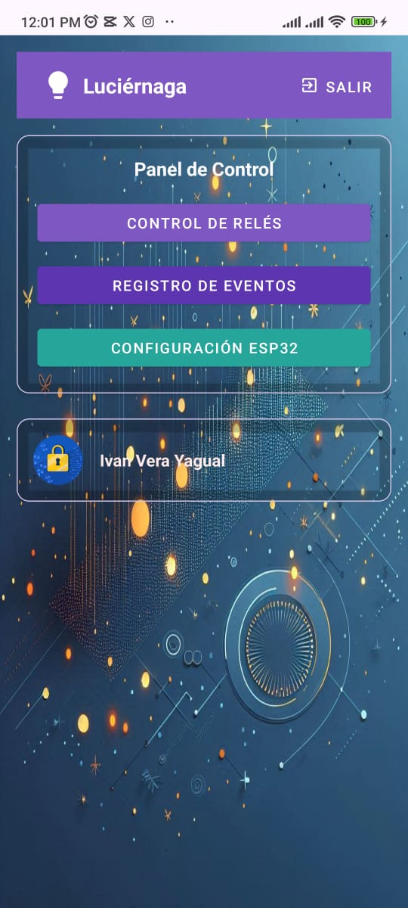
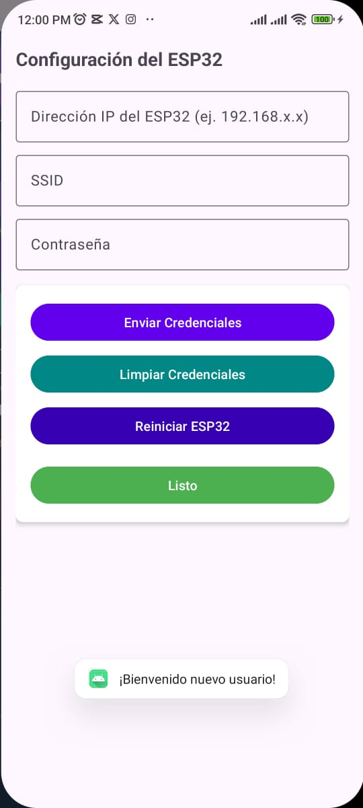
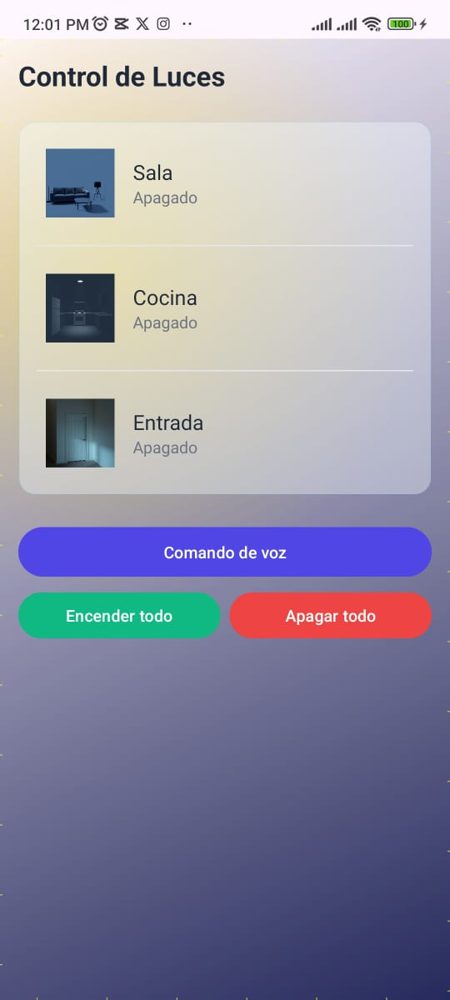
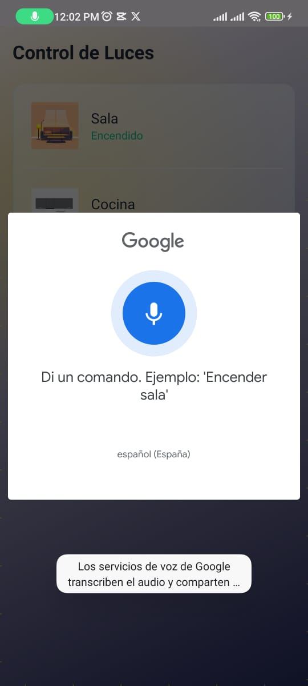
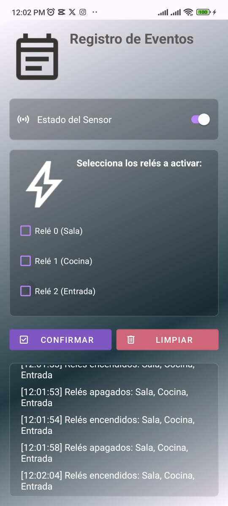

# 🚀 Luciérnaga - Control IoT de Iluminación


  Sistema de Control con ESP32 y Android
  - Control de luces mediante wifi
  - Automatización con sensores
  - Interfaz móvil intuitiva

# Hardware
ESP32 = 1
Modulo_Relees = 3
Sensor_Ultrasonico = 1
Fuente_5V = 1

# Software
Arduino_IDE = "1.8.19+"
Android_Studio = "2022.3.1+"

# 🌟 Características Clave
+ Control por voz integrado
+ Interfaz móvil amigable
+ Registro de eventos en tiempo real
- Requiere conexión WiFi estable

  ## 📸 Galería del Proyecto

<div align="center" style="display: grid; grid-template-columns: repeat(auto-fill, minmax(250px, 1fr)); gap: 15px; margin: 20px 0;">

  
  
  
  
  
  
  
  
  
  
</div>

📌 *Haz clic en cada imagen para ampliar*

# 📥 Instalación de la App Android

## Método 1: Descarga Directa (APK)
[Descargar APK](https://drive.google.com/file/d/12HMlnD-l2FoLzqXwc9nRiztTn6f-CuRO/view?usp=drivesdk)

1. Haz clic en el botón arriba ↑
2. Permite "Instalar aplicaciones desconocidas" en tu Android
3. Abre el archivo `.apk` descargado
4. ¡Listo! La app se instalará automáticamente

## Método 2: Compilar desde código
```bash
git clone https://github.com/IvanVY/Luciernaga_V2.0.git
cd luciernaga/android
./gradlew assembleDebug
# El APK estará en: app/build/outputs/apk/debug/
